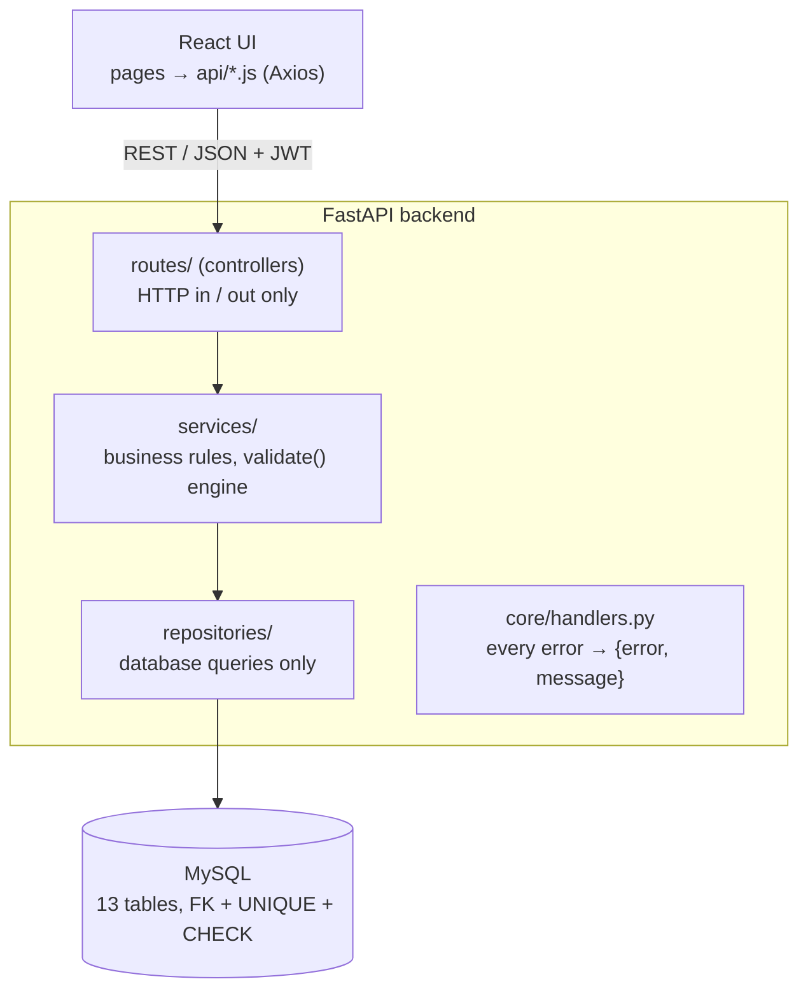

# StockSense — Inventory Management System

**Odoo x GCET Hyderabad Hackathon 2026 · Team DARK-FIZZ**

StockSense replaces paper registers and Excel sheets with one real-time system for
receiving, delivering, moving and counting stock across multiple warehouses.
Every unit on hand is backed by a row in an append-only stock ledger.

| Member | Role | Owns |
|---|---|---|
| Dheekshith | Frontend | React screens, client-side validation, API calls |
| Rauf | Backend | Database schema, migrations, REST API, auth, operations engine |
| Rohit | Error handling, testing, docs | Global error handling, tests, README, Docker setup, repo hygiene |

---

## Features

- **Auth:** signup, login (JWT), OTP password reset by email, manager / staff roles
- **Dashboard:** products in stock, low / out of stock, pending receipts, pending deliveries,
  transfers scheduled; filters by warehouse, category, document type and status
- **Products:** create / edit with SKU, category, unit of measure and optional initial stock;
  SKU / name search; stock per location
- **Operations** (one engine for all four):
  - **Receipts** — incoming goods from suppliers, stock increases on validate
  - **Deliveries** — outgoing goods to customers, stock decreases on validate
  - **Internal transfers** — between warehouses, racks or the production floor
  - **Adjustments** — enter the counted quantity; the system logs the difference
- **Move history:** every stock movement, who did it and when
- **Alerts:** low-stock list with reorder suggestions (order up to the rule's maximum)
- **Multi-warehouse** with internal locations per warehouse

## Tech stack (100% free / open source)

| Layer | Tech |
|---|---|
| Frontend | React + Vite, Tailwind CSS, React Router, Axios |
| Backend | Python 3.11+, FastAPI, Pydantic v2 |
| Database | MySQL 8.4, SQLAlchemy 2.0 ORM, Alembic migrations |
| Auth | bcrypt password hashing, JWT (PyJWT), 6-digit OTP (hashed, 10 min, 5 tries) |
| Email | Mailpit (local mail catcher for OTP emails) |
| Infra / quality | Docker Compose, pytest, Ruff, ESLint |

## Architecture



Every request goes **route → service → repository → database**. Routes never run SQL;
repositories never contain business rules.

### The key design decision

**Every stock change is a move from one location to another.** Vendors, Customers and
Inventory Adjustment are *virtual* locations. So:

| Operation | From | To |
|---|---|---|
| Receipt | Vendors (virtual) | a warehouse location |
| Delivery | a warehouse location | Customers (virtual) |
| Internal | a warehouse location | another warehouse location |
| Adjustment | Inventory Adjustment ↔ a warehouse location (direction from the count) |

One `validate()` handles all four, inside **one database transaction**:
1. lock the stock rows being changed (`SELECT … FOR UPDATE`)
2. refuse with `409 INSUFFICIENT_STOCK` if there isn't enough
3. update `stock_quants` (on hand) and insert `stock_moves` (the ledger)
4. mark the operation `done`

If any step fails, nothing is saved. The database backs this up with
`CHECK (quantity >= 0)` on stock, so stock can never go negative even if code had a bug.

### Database

See the full ER diagram: [`docs/er-diagram.md`](docs/er-diagram.md)

- `stock_quants` — on-hand quantity per (product, location); primary key is the pair
- `stock_moves` — append-only ledger; `SUM(in) − SUM(out)` per location always equals the quant
- Constraints: foreign keys everywhere, `UNIQUE` on email / SKU / warehouse code / reference,
  `CHECK` on quantities, reorder min ≤ max, and source ≠ destination
- Indexes on `operations(type, status)` and `stock_moves(product_id, done_at)` for the dashboard and history

### Error handling

Every failure returns the same shape, never a raw 500 or stack trace:

```json
{ "error": "INSUFFICIENT_STOCK", "message": "Not enough stock. Steel: 10 available, 25 requested." }
```

| Situation | Status | error |
|---|---|---|
| Missing / invalid field, weak password | 400 | `VALIDATION_ERROR` |
| Malformed JSON | 400 | `MALFORMED_REQUEST` |
| Wrong email or password (same message for both) | 401 | `INVALID_CREDENTIALS` |
| No / expired token | 401 | `UNAUTHORIZED` |
| Staff doing a manager-only action | 403 | `FORBIDDEN` |
| Unknown ID or address | 404 | `NOT_FOUND` |
| Duplicate email / SKU | 409 | `EMAIL_ALREADY_EXISTS` / `DUPLICATE_SKU` |
| Delivering more than on hand | 409 | `INSUFFICIENT_STOCK` |
| Validating a done operation, cancelling a done one | 409 | `INVALID_STATE` |
| Database down | 503 | `DATABASE_UNAVAILABLE` |
| Anything unexpected | 500 | `INTERNAL_ERROR` (with a reference id; details only in the server log) |

Database errors (duplicate, CHECK, foreign key, connection lost) are translated
automatically in `backend/app/core/handlers.py`. The frontend shows `message` in a toast
and a banner when the server or database is unreachable.

---

## Run it locally

> **Run the backend and the frontend on the same machine.** The frontend calls
> `http://localhost:8000`, which means "this computer". If the backend runs on a
> different laptop, the app shows *"The server is not reachable"*.

### Prerequisites

- Python 3.11+, Node.js 20+, Git
- MySQL 8.0.16+ (installed locally **or** via Docker) — CHECK constraints need 8.0.16+

### 1. Database

**Option A — Docker** (MySQL 8.4 + Mailpit for OTP emails):

```bash
docker compose up -d
```

**Option B — MySQL already installed.** Run once as root:

```sql
CREATE DATABASE stocksense CHARACTER SET utf8mb4;
CREATE USER 'stocksense'@'localhost' IDENTIFIED BY 'stocksense';
GRANT ALL PRIVILEGES ON stocksense.* TO 'stocksense'@'localhost';
```

With Option B you can still run only the mail catcher: `docker compose up -d mailpit`.

### 2. Backend (terminal 1)

```bash
cd backend
python -m venv venv
source venv/bin/activate            # Windows: venv\Scripts\activate
pip install -r requirements.txt
cp .env.example .env                # Windows: copy .env.example .env
alembic upgrade head                # creates all 13 tables
python -m app.seed                  # demo warehouses, locations, products, users
uvicorn app.main:app --reload
```

`alembic upgrade head` must print `Running upgrade -> 0001_initial, initial schema`.

- API: http://localhost:8000 (the root `/` returns a `NOT_FOUND` JSON error — that's expected)
- Health check: http://localhost:8000/health → `{"status":"ok"}`
- **Interactive API docs: http://localhost:8000/docs**

### 3. Frontend (terminal 2)

```bash
cd frontend
npm install
cp .env.example .env                # Windows: copy .env.example .env
npm run dev
```

App: **http://localhost:5173**

### Demo logins

| Role | Email | Password |
|---|---|---|
| Manager | manager@stocksense.com | Manager@123 |
| Staff | staff@stocksense.com | Staff@123 |

New sign-ups are always **staff**.

### OTP password reset — where the code goes

The 6-digit code is stored **hashed**, expires in **10 minutes** and allows **5 attempts**.
Delivery depends on `backend/.env`, checked in this order:

| Setup | Where the code appears |
|---|---|
| Default (`SMTP_HOST=localhost`, Mailpit running) | Mailpit inbox at http://localhost:8025 |
| Real email (`SMTP_HOST=smtp.gmail.com`, `SMTP_PORT=587`, `SMTP_USER`, `SMTP_PASSWORD` = Gmail App Password) | the user's real inbox |
| Neither reachable | the backend terminal: `DEV ONLY OTP for <email> is <code>` |

Email failure never breaks the reset — the code is always logged as a fallback.
**Known limitation:** real-inbox delivery did not work on the hackathon network in time,
so the demo video reads the code from the backend log.
The terminal fallback is for local development only and would be removed in production.

### Reset to a clean demo

```sql
DROP DATABASE stocksense;
CREATE DATABASE stocksense CHARACTER SET utf8mb4;
```

then `alembic upgrade head` and `python -m app.seed` again.

### Environment variables (`backend/.env`)

| Name | Example | Meaning |
|---|---|---|
| `DB_USER` / `DB_PASSWORD` | stocksense | MySQL login |
| `DB_HOST` / `DB_PORT` | localhost / 3306 | MySQL address |
| `DB_NAME` | stocksense | database name |
| `SECRET_KEY` | long random text | signs JWT tokens |
| `ALGORITHM` | HS256 | JWT algorithm |
| `ACCESS_TOKEN_EXPIRE_MINUTES` | 60 | login lifetime |
| `SMTP_HOST` / `SMTP_PORT` | localhost / 1025 | Mailpit |

Frontend: `frontend/.env` → `VITE_API_URL=http://localhost:8000`

---

## Demo walkthrough (the problem statement's steel example)

1. Log in as the manager → **Dashboard**
2. **Operations → New → Receipt:** Steel, 100 kg into `WH/Stock` → Create draft → **Validate** (stock +100)
3. **New → Internal transfer:** Steel 100, `WH/Stock` → `WH/Production Rack` → Validate (total unchanged)
4. **New → Delivery:** Steel 20 from `WH/Production Rack` → Validate (stock −20)
5. **New → Adjustment:** `WH/Production Rack`, counted **77** → Validate (logs −3)
6. **Operations → Move history:** 4 ledger rows · **Products → Steel:** 77 kg at Production Rack
7. **Dashboard:** Steel is low stock (77 ≤ min 80) → reorder suggestion **123**

Try the errors: deliver more than on hand, create SKU `STL-001` again, wrong password,
or log in as staff and try a manager action.

## API reference

Full, clickable docs at **/docs**. All routes except `/auth/*` and `/health` need
`Authorization: Bearer <token>`. 🔒 = manager only.

| Method | Path | Purpose |
|---|---|---|
| POST | `/auth/signup` · `/auth/login` | create account · get JWT |
| POST | `/auth/forgot-password` · `/auth/reset-password` | OTP reset |
| GET | `/auth/me` | current user |
| GET | `/dashboard/kpis` · `/dashboard/low-stock` | KPIs (filters: `warehouse_id`, `category_id`) · alerts + reorder qty |
| GET / POST 🔒 | `/products` | list (`q`, `category_id`) / create (optional initial stock) |
| GET / PUT 🔒 | `/products/{id}` | read / update |
| GET | `/products/{id}/stock` | stock per location |
| GET / POST 🔒 | `/categories`, `/warehouses`, `/locations` | master data |
| GET | `/uoms`, `/partners` | units, suppliers / customers |
| GET / PUT 🔒 | `/reorder-rules` | reordering rules (min / max) |
| GET / POST | `/operations` | list (`type`, `status`, `warehouse_id`) / create draft |
| GET | `/operations/{id}` | detail with lines and availability |
| POST | `/operations/{id}/confirm` · `/validate` · `/cancel` | status changes; `validate` moves stock |
| GET | `/moves` | stock ledger (move history), paged with `limit` / `offset` |
| GET | `/health` | database connectivity check |

## Troubleshooting

| You see | Cause | Fix |
|---|---|---|
| Orange banner *"server is not reachable"* | backend not running on **this** machine | start `uvicorn` in `backend/` on the same computer |
| `npm error ENOENT ... package.json` | `npm` run from the repo root | `cd frontend` first |
| `alembic upgrade head` prints no "Running upgrade" line | database already at the latest version, or migration missing | check `backend/alembic/versions/0001_initial_schema.py` exists; reset the database |
| `{"error":"NOT_FOUND"}` at http://localhost:8000 | there is no page at `/` | open `/docs` or `/health` |
| `port is already allocated` (Docker) | local MySQL already uses 3306 | stop it, or map `"3307:3306"` and set `DB_PORT=3307` |
| CHECK constraints not enforced | MySQL older than 8.0.16 | use the Docker MySQL 8.4 |
| OTP never reaches the inbox | Mailpit not running, or network blocks SMTP port 587 | read the code from the backend terminal (`DEV ONLY OTP ...`), or `docker compose up -d mailpit` |
| `SMTPAuthenticationError` in the log | normal Gmail password used | create a Gmail **App Password** (needs 2-Step Verification) |

## Tests

```bash
cd backend
python -m pytest -v
```

27 tests, no database server needed (they use an in-memory database):
- the problem statement's steel flow end to end: receive 100 → transfer → deliver 20 →
  adjust −3 ⇒ **77 on hand, 4 ledger rows, low-stock alert, reorder 123**
- ledger totals always equal stock on hand
- every error in the table above, including database-down and crash handling

## Project structure

```
backend/
  app/
    main.py            app + router wiring
    core/              errors, handlers, logging, security (JWT, roles)
    models/            SQLAlchemy tables
    schemas/           Pydantic request / response models (validation)
    repositories/      database queries
    services/          business rules (operations engine, auth, dashboard)
    routes/            REST controllers
    seed.py            demo data
  alembic/             migrations
  tests/
frontend/src/
  api/                 Axios client + endpoint functions
  context/             logged-in user
  components/          shared UI, toast, error boundary, server-down banner
  pages/               6 screens
docs/er-diagram.md
docker-compose.yml
```