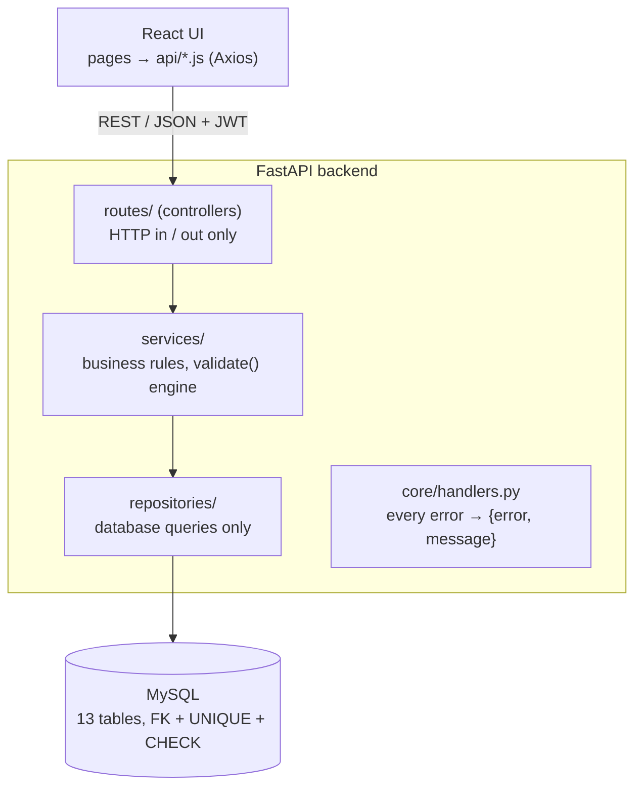

# StockSense — Inventory Management System

**Odoo x GCET Hyderabad Hackathon 2026 · Team DARK-FIZZ**

StockSense replaces paper registers and Excel sheets with one real-time system for
receiving, delivering, moving and counting stock across multiple warehouses.
Every unit on hand is backed by a row in an append-only stock ledger.

| Member | Role | Owns |
|---|---|---|
| Dheekshith | Frontend | React screens, client-side validation, API calls |
| Rauf | Backend | Database schema, migrations, REST API, auth, operations engine |
| Rohit | Error handling, testing, docs | Global error handling, tests, README, repo hygiene |

---

## Features

- **Auth:** signup, login (JWT), OTP password reset by email, manager / staff roles
- **Dashboard:** products in stock, low / out of stock, pending receipts, pending deliveries,
  transfers scheduled; filters by warehouse, category, document type and status
- **Products:** create / edit with SKU, category, unit of measure and optional initial stock;
  SKU / name search; stock per location
- **Operations** (one engine for all four):
  - **Receipts** — incoming goods from suppliers, stock increases on validate
  - **Deliveries** — outgoing goods to customers, stock decreases on validate
  - **Internal transfers** — between warehouses, racks or the production floor
  - **Adjustments** — enter the counted quantity; the system logs the difference
- **Move history:** every stock movement, who did it and when
- **Alerts:** low-stock list with reorder suggestions (order up to the rule's maximum)
- **Multi-warehouse** with internal locations per warehouse

## Tech stack (100% free / open source)

| Layer | Tech |
|---|---|
| Frontend | React + Vite, Tailwind CSS, React Router, Axios |
| Backend | Python 3.11+, FastAPI, Pydantic v2 |
| Database | MySQL 8.4, SQLAlchemy 2.0 ORM, Alembic migrations |
| Auth | bcrypt password hashing, JWT (PyJWT), 6-digit OTP (hashed, 10 min, 5 tries) |
| Email | Mailpit (local mail catcher for OTP emails) |
| Infra / quality | Docker Compose, pytest, Ruff, ESLint |

## Architecture



Every request goes **route → service → repository → database**. Routes never run SQL;
repositories never contain business rules.

### The key design decision

**Every stock change is a move from one location to another.** Vendors, Customers and
Inventory Adjustment are *virtual* locations. So:

| Operation | From | To |
|---|---|---|
| Receipt | Vendors (virtual) | a warehouse location |
| Delivery | a warehouse location | Customers (virtual) |
| Internal | a warehouse location | another warehouse location |
| Adjustment | Inventory Adjustment ↔ a warehouse location (direction from the count) |

One `validate()` handles all four, inside **one database transaction**:
1. lock the stock rows being changed (`SELECT … FOR UPDATE`)
2. refuse with `409 INSUFFICIENT_STOCK` if there isn't enough
3. update `stock_quants` (on hand) and insert `stock_moves` (the ledger)
4. mark the operation `done`

If any step fails, nothing is saved. The database backs this up with
`CHECK (quantity >= 0)` on stock, so stock can never go negative even if code had a bug.

### Database

See the full ER diagram: [`docs/er-diagram.md`](docs/er-diagram.md)

- `stock_quants` — on-hand quantity per (product, location); primary key is the pair
- `stock_moves` — append-only ledger; `SUM(in) − SUM(out)` per location always equals the quant
- Constraints: foreign keys everywhere, `UNIQUE` on email / SKU / warehouse code / reference,
  `CHECK` on quantities, reorder min ≤ max, and source ≠ destination
- Indexes on `operations(type, status)` and `stock_moves(product_id, done_at)` for the dashboard and history

### Error handling

Every failure returns the same shape, never a raw 500 or stack trace:

```json
{ "error": "INSUFFICIENT_STOCK", "message": "Not enough stock. Steel: 10 available, 25 requested." }
```

| Situation | Status | error |
|---|---|---|
| Missing / invalid field, weak password | 400 | `VALIDATION_ERROR` |
| Malformed JSON | 400 | `MALFORMED_REQUEST` |
| Wrong email or password (same message for both) | 401 | `INVALID_CREDENTIALS` |
| No / expired token | 401 | `UNAUTHORIZED` |
| Staff doing a manager-only action | 403 | `FORBIDDEN` |
| Unknown ID or address | 404 | `NOT_FOUND` |
| Duplicate email / SKU | 409 | `EMAIL_ALREADY_EXISTS` / `DUPLICATE_SKU` |
| Delivering more than on hand | 409 | `INSUFFICIENT_STOCK` |
| Validating a done operation, cancelling a done one | 409 | `INVALID_STATE` |
| Database down | 503 | `DATABASE_UNAVAILABLE` |
| Anything unexpected | 500 | `INTERNAL_ERROR` (with a reference id; details only in the server log) |

Database errors (duplicate, CHECK, foreign key, connection lost) are translated
automatically in `backend/app/core/handlers.py`. The frontend shows `message` in a toast
and a banner when the server or database is unreachable.

---

## Run it locally

### 1. Database + mail (Docker)

```bash
docker compose up -d          # MySQL 8.4 on 3306, Mailpit on 8025
```

Already have MySQL 8.0.16+ installed? Skip Docker for the database and run once:

```sql
CREATE DATABASE stocksense CHARACTER SET utf8mb4;
CREATE USER 'stocksense'@'localhost' IDENTIFIED BY 'stocksense';
GRANT ALL PRIVILEGES ON stocksense.* TO 'stocksense'@'localhost';
```

### 2. Backend

```bash
cd backend
python -m venv venv
source venv/bin/activate            # Windows: venv\Scripts\activate
pip install -r requirements.txt
cp .env.example .env                # Windows: copy .env.example .env
alembic upgrade head                # creates all tables
python -m app.seed                  # demo warehouses, locations, products, users
uvicorn app.main:app --reload
```

API: http://localhost:8000 · Interactive docs: **http://localhost:8000/docs**

### 3. Frontend

```bash
cd frontend
npm install
cp .env.example .env                # Windows: copy .env.example .env
npm run dev
```

App: http://localhost:5173

### Demo logins

| Role | Email | Password |
|---|---|---|
| Manager | manager@stocksense.com | Manager@123 |
| Staff | staff@stocksense.com | Staff@123 |

OTP emails appear in Mailpit at http://localhost:8025. (If Mailpit isn't running, the
backend logs the code to its console — dev only.)

### Environment variables (`backend/.env`)

| Name | Example | Meaning |
|---|---|---|
| `DB_USER` / `DB_PASSWORD` | stocksense | MySQL login |
| `DB_HOST` / `DB_PORT` | localhost / 3306 | MySQL address |
| `DB_NAME` | stocksense | database name |
| `SECRET_KEY` | long random text | signs JWT tokens |
| `ALGORITHM` | HS256 | JWT algorithm |
| `ACCESS_TOKEN_EXPIRE_MINUTES` | 60 | login lifetime |
| `SMTP_HOST` / `SMTP_PORT` | localhost / 1025 | Mailpit |

## Tests

```bash
cd backend
python -m pytest -v
```

27 tests, no database server needed (they use an in-memory database):
- the problem statement's steel flow end to end: receive 100 → transfer → deliver 20 →
  adjust −3 ⇒ **77 on hand, 4 ledger rows, low-stock alert, reorder 123**
- ledger totals always equal stock on hand
- every error in the table above, including database-down and crash handling

## Project structure

```
backend/
  app/
    main.py            app + router wiring
    core/              errors, handlers, logging, security (JWT, roles)
    models/            SQLAlchemy tables
    schemas/           Pydantic request / response models (validation)
    repositories/      database queries
    services/          business rules (operations engine, auth, dashboard)
    routes/            REST controllers
    seed.py            demo data
  alembic/             migrations
  tests/
frontend/src/
  api/                 Axios client + endpoint functions
  context/             logged-in user
  components/          shared UI, toast, error boundary, server-down banner
  pages/               6 screens
docs/er-diagram.md
docker-compose.yml
```