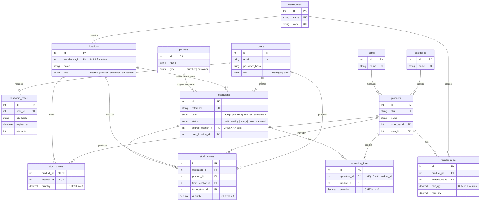

# StockSense – Database ER Diagram

Every stock change is a move between two locations. Vendor, Customer and
Adjustment are virtual locations, so receipts, deliveries, transfers and
adjustments all use the same tables. `stock_moves` is the append-only ledger;
`stock_quants` holds on-hand quantity per product per location.

